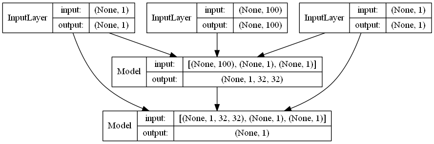
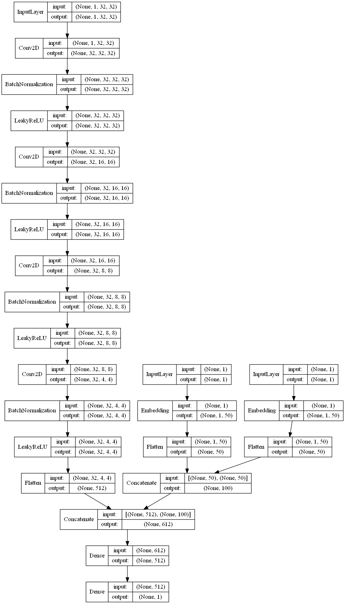

# Conditional-GAN
In this project, we trained a Conditional-GAN network on 26 characters (A to Z) from 9000 different fonts in the training stage. The architecture of the whole systems was as follows:

In both Discriminator and Generator netwokrs we used Convolutional layers. The structures of these networks are as follows:

## Generator:

In the generator network, the lables related to fonts and characters first get embedded and concatenated and the result gets concatentaed with a sampling from a distribution. The result is then passed through a number of Conv layers and the output of the network would be an image with the size of real character images.

## Discriminator:

In the discriminator network, in half of trials (in a batch) the input is a real image and in another half the input is a fake image (produced by Generator). This input is first passed through a number of Conv layers, then the output of last Conv layer gets concatenated with the embedded version of labels (related to font and character) and the result is passed through two fully-connected layers. The output of this network would be a label related to being fake or real.

## Results:

The trainging process ends when the systems reaches to the Nash Equilibrium (when the loss of two networks are closest). In our experiment, the loss of both networks in traning stage were as follows:

After the end of training process, by controling the labels of font and character in Generator network, we produced a sentence with 9000 new fonts. Some samples are as follows:

